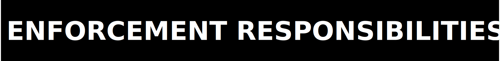

  

  

We as contributors and maintainers pledge to make participation in
ZPE Geo a harassment-free experience for everyone, regardless of
age, body size, visible or invisible disability, ethnicity, sex
characteristics, gender identity and expression, level of
experience, education, socio-economic status, nationality, personal
appearance, race, caste, colour, religion, or sexual identity and
orientation.

We pledge to act and interact in ways that contribute to an open,
welcoming, and evidence-led community.

---

  

### Expected behaviour

- Demonstrating empathy and respect toward other contributors
- Being respectful of differing technical opinions and
  interpretations, including inconclusive or negative findings
- Giving and gracefully accepting evidence-backed feedback
- Accepting responsibility for mistakes and correcting them clearly
- Focusing on what is best for the integrity of the repo, the proof
  surface, and the workstream community
- Preserving negative results and contradictions rather than hiding
  them behind cleaner prose

### Unacceptable behaviour

- Harassment, intimidation, or discrimination in any form
- Trolling, insulting, or derogatory comments
- Publishing others' private information without explicit permission
- Inflating repo claims beyond the current artifact trail
- Laundering outer-workspace material or unsafe operator-only state
  into this Git-backed repo without an explicit copy-back decision
- Sustained bad-faith engagement that disputes evidence-backed facts
  without counter-evidence
- Any conduct that a reasonable person would consider inappropriate
  in a professional setting

---

  

This Code of Conduct applies within all project spaces: GitHub
issues, pull requests, discussions, commit messages, code review
comments, proof notes, and any space where the repo is officially
represented.

---

  

Maintainers are responsible for clarifying and enforcing these
standards. They may remove, edit, or reject comments, commits, code,
issues, and other contributions that are not aligned with this Code
of Conduct, and will communicate reasons for moderation decisions
where appropriate.

---

  

Instances of unacceptable behaviour may be reported to:

**`architects@zer0pa.ai`**

All reports will be reviewed promptly and investigated with
confidentiality. The reporter's identity will not be disclosed
without explicit consent.

---

  

Maintainers will follow these guidelines when determining
consequences for violations:

### 1. Correction

**Impact:** Minor inappropriate language or unprofessional
behaviour.
**Consequence:** Private written warning with explanation.

### 2. Warning

**Impact:** A single incident or a pattern of minor violations.
**Consequence:** Formal warning with defined consequences for
continued behaviour.

### 3. Temporary Ban

**Impact:** A serious violation or sustained inappropriate
behaviour.
**Consequence:** Temporary ban from all community interaction
and contribution.

### 4. Permanent Ban

**Impact:** Demonstrated pattern of violations, harassment,
sustained bad-faith technical conduct, or repeated attempts to
degrade the proof boundary.
**Consequence:** Permanent ban from all public community
interaction and contribution.

---

  

ZPE Geo operates under falsifiability-first principles. In this
community that means:

- Claims require evidence. Unsupported improvements are noise until
  artifacts exist.
- Negative results are protected. A contributor who surfaces a real
  failure or contradiction is helping the project.
- Scope discipline is non-negotiable. Repo-local package truth,
  current copied-back operator truth, and archived historical truth
  must stay distinct.
- The docs surface must not drift from the authoritative repo facts:
  URL, license boundary, current status, and proof routing must stay
  explicit and aligned.

Violations of evidence discipline that affect the integrity of the
repo or proof corpus will be treated under the enforcement
guidelines above.

---

  

This Code of Conduct is adapted from the
[Contributor Covenant, version 2.1](https://www.contributor-covenant.org/version/2/1/code_of_conduct.html).
Community Impact Guidelines were inspired by
[Mozilla's Code of Conduct Enforcement Ladder](https://github.com/mozilla/inclusion).
