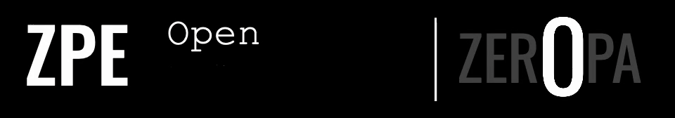
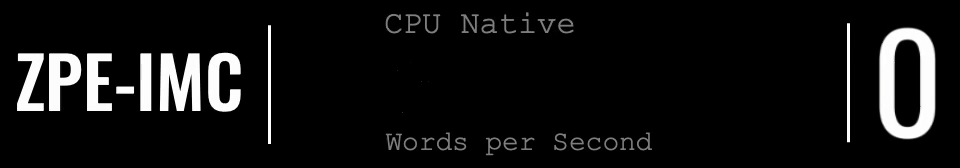

<p align="center">
  
</p>

<h1 align="center">ZPE Geo</h1>

<p align="center">
  <a href="LICENSE"></a>
  <a href="code/README.md"></a>
  <a href="proofs/FINAL_STATUS.md"></a>
  <a href="proofs/artifacts/2026-03-21_operator_status/README.md"></a>
  <a href="proofs/artifacts/2026-02-20_zpe_geo_wave1/claim_status_delta.md"></a>
</p>
<p align="center">
  <a href="code/README.md"></a>
  <a href="proofs/FINAL_STATUS.md"></a>
  <a href="docs/ARCHITECTURE.md"></a>
  <a href="PUBLIC_AUDIT_LIMITS.md"></a>
  <a href="docs/README.md"></a>
</p>
<table align="center" width="100%" cellpadding="0" cellspacing="0">
  <tr>
    <td width="25%"><a href="#quick-start"></a></td>
    <td width="25%"><a href="#what-this-is"></a></td>
    <td width="25%"><a href="#current-authority"></a></td>
    <td width="25%"><a href="#go-next"></a></td>
  </tr>
</table>

---

## What This Is

ZPE-Geo compresses and indexes movement traces — fleet routes, vessel tracks, AV telemetry, logistics trajectories — so they stay searchable after compression. H3 hexagonal spatial indexing, maneuver-aware search, and deterministic fidelity validation all operate on the compressed representation.

This is for teams that store or transmit large volumes of trajectory data and need compression that preserves query capability. The codec does not just shrink traces; it indexes maneuvers during encoding so downstream search never touches the raw stream.

ZPE Geo is the Git-backed workstream repo for deterministic geospatial trajectory compression, fidelity checks, maneuver search, H3 roundtrip validation, proof custody, and documentation routing. SAL v6.0 is free below $100M annual revenue. See [LICENSE](LICENSE).

| Field | Value |
|-------|-------|
| Architecture | TRAJECTORY_MANIFOLD |
| Encoding | H3_HEX_PACK |

## Key Metrics

| Metric | Value | Tag |
|--------|-------|-----|
| Capabilities | compress+index+search | TRIPLE_OP |
| Spatial Index | H3 hex | HIERARCHICAL |
| Tests | lightweight pass | LOCAL_ONLY |
| Open Gates | C001 C002 C004 | 3_OPEN |

<p align="center">
  
</p>

## What We Prove

- Trajectory compression with preserved query capability
- H3 hexagonal spatial indexing during encoding
- Maneuver-aware search on compressed representation
- Lightweight test suite passes

## What We Don't Claim

- No claim of blind-clone closure (GEO-C001)
- No claim of full-corpus closure (GEO-C002)
- No claim of release readiness (GEO-C004)
- No claim of superiority over incumbent geospatial compression

<p align="center">
  
</p>

## Commercial Readiness

| Field | Value |
|-------|-------|
| Verdict | NOT_RELEASE_READY |
| Commit SHA | bb9b5e39fc2e |
| Confidence | 62.5% |
| Source | proofs/FINAL_STATUS.md |

- Supporting operator pack: [proofs/artifacts/2026-03-21_operator_status/README.md](proofs/artifacts/2026-03-21_operator_status/README.md)
- Open gates: `GEO-C001`, `GEO-C002`, `GEO-C004`
- Confidence basis: `5 / 8` tracked claims green on [proofs/artifacts/2026-03-21_operator_status/phase0311_runpod/max_claim_resource_map.json](proofs/artifacts/2026-03-21_operator_status/phase0311_runpod/max_claim_resource_map.json)

<p align="center">
  
</p>

## Tests and Verification

| Code | Check | Verdict |
|------|-------|---------|
| V_01 | Repo-local package surface | PASS |
| V_02 | Lightweight code tests | PASS |
| V_03 | GEO-C001 blind-clone closure | FAIL |
| V_04 | GEO-C002 full-corpus closure | FAIL |
| V_05 | GEO-C004 release readiness | FAIL |
| V_06 | H3 roundtrip consistency | PASS |

## Proof Anchors

| Path | State |
|------|-------|
| proofs/FINAL_STATUS.md | VERIFIED |
| proofs/CONSOLIDATED_PROOF_REPORT.md | VERIFIED |
| proofs/artifacts/2026-03-21_operator_status/README.md | VERIFIED |
| proofs/artifacts/2026-03-21_operator_status/phase0311_runpod/max_claim_resource_map.json | VERIFIED |
| proofs/artifacts/2026-03-21_operator_status/release_alignment/TECHNICAL_ALIGNMENT_REPORT.md | VERIFIED |

Quickest outsider orientation:

| Route | Why |
| --- | --- |
| [proofs/FINAL_STATUS.md](proofs/FINAL_STATUS.md) | Governing current repo verdict |
| [PUBLIC_AUDIT_LIMITS.md](PUBLIC_AUDIT_LIMITS.md) | Explicit public claim boundary |
| [AUDITOR_PLAYBOOK.md](AUDITOR_PLAYBOOK.md) | Audit route and reading order |
| [code/README.md](code/README.md) | Install-facing package surface |

## Repo Shape

| Field | Value |
|-------|-------|
| Proof Anchors | 5 |
| Modality Lanes | 4 |
| Authority Source | proofs/FINAL_STATUS.md |

<p align="center">
  
</p>

## Quick Start

### Quick Verify

The steps below verify the current repo-local package surface. They do not prove blind-clone closure, full-corpus closure, or release readiness.

```bash
git clone https://github.com/Zer0pa/ZPE-Geo.git zpe-geo
cd zpe-geo
python -m venv .venv
source .venv/bin/activate
python -m pip install -e "./code[dev,h3]"
python -m pytest code/tests -q
python - <<'PY'
from zpe_geo import H3Bridge, ManeuverSearchIndex, decode_trajectory, encode_trajectory
print("zpe-geo import OK")
print("h3 backend:", H3Bridge().backend)
print("search surface:", ManeuverSearchIndex.__name__)
PY
```

After a successful repo-local verification you should have:

- an editable install of the inner `code/` package surface
- passing lightweight repo-local tests under `code/tests`
- an importable `zpe_geo` surface without relying on outer-workspace material

### License Boundary

- This repo uses the same SAL v6.0 license text as the current `ZPE-IMC` reference surface.
- SPDX tag: `LicenseRef-Zer0pa-SAL-6.0`.
- Commercial or hosted use above the SAL threshold requires contact at `architects@zer0pa.ai`.
- `LICENSE` is the legal source of truth. Repo docs summarize it; they do not override it.

<p align="center">
  
</p>

## Ecosystem

| Workstream | Route | Notes |
| --- | --- | --- |
| ZPE Geo | [github.com/Zer0pa/ZPE-Geo](https://github.com/Zer0pa/ZPE-Geo) | This geospatial codec, search, and H3 workstream. |
| ZPE-IMC | [github.com/Zer0pa/ZPE-IMC](https://github.com/Zer0pa/ZPE-IMC) | Current documentation-structure reference surface reused by sibling repos. |
| ZPE-FT | [github.com/Zer0pa/ZPE-FT](https://github.com/Zer0pa/ZPE-FT) | Parallel ZPE family workstream. |
| ZPE-Bio | [github.com/Zer0pa/ZPE-Bio](https://github.com/Zer0pa/ZPE-Bio) | Parallel ZPE family workstream. |
| ZPE-IoT | [github.com/Zer0pa/ZPE-IoT](https://github.com/Zer0pa/ZPE-IoT) | Parallel ZPE family workstream. |

## Historical Context Only

The archived bundle under [proofs/artifacts/2026-02-20_zpe_geo_wave1/](proofs/artifacts/2026-02-20_zpe_geo_wave1/) remains part of the repo because it contains real historical evidence:

- archived performance metrics across all eight promoted claims
- archived comparator notes, including an in-repo AIS baseline comparison
- preserved contradictions that explain why archived success does not equal current release authorization

Read those facts as historical-only context through [proofs/CONSOLIDATED_PROOF_REPORT.md](proofs/CONSOLIDATED_PROOF_REPORT.md), not as current release status.

## Go Next

| Need | Route |
| --- | --- |
| Current verdict and release posture | [proofs/FINAL_STATUS.md](proofs/FINAL_STATUS.md) |
| Detailed current evidence and historical bundle interpretation | [proofs/CONSOLIDATED_PROOF_REPORT.md](proofs/CONSOLIDATED_PROOF_REPORT.md) |
| Audit path | [AUDITOR_PLAYBOOK.md](AUDITOR_PLAYBOOK.md) |
| Audit limits and exclusions | [PUBLIC_AUDIT_LIMITS.md](PUBLIC_AUDIT_LIMITS.md) |
| Architecture and evidence map | [docs/ARCHITECTURE.md](docs/ARCHITECTURE.md) |
| Docs ownership map | [docs/CANONICAL_DOC_REGISTRY.md](docs/CANONICAL_DOC_REGISTRY.md) |
| FAQ and support | [docs/FAQ.md](docs/FAQ.md), [docs/SUPPORT.md](docs/SUPPORT.md) |
| Community conduct | [CODE_OF_CONDUCT.md](CODE_OF_CONDUCT.md) |
| Install surface | [code/README.md](code/README.md) |

## Contributing, Security, Support

| Need | Route |
| --- | --- |
| Contribution rules and docs hygiene | [CONTRIBUTING.md](CONTRIBUTING.md) |
| Community conduct and evidence norms | [CODE_OF_CONDUCT.md](CODE_OF_CONDUCT.md) |
| Vulnerability reporting and secret-exposure handling | [SECURITY.md](SECURITY.md) |
| Reader routing and response expectations | [docs/SUPPORT.md](docs/SUPPORT.md) |
