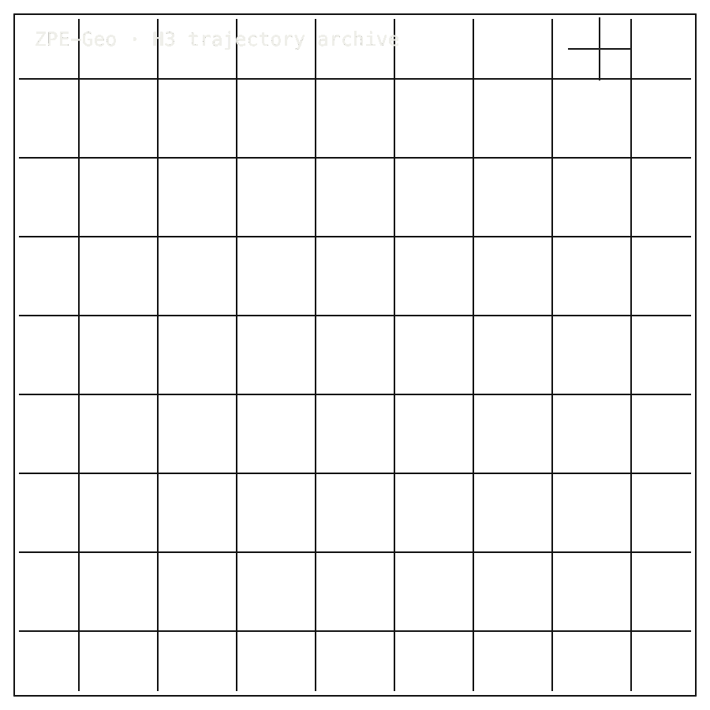

# ZPE-Geo

## Package Install

Installable package: `python3.11 -m pip install zpe-geo`.
Current release: `0.1.1` on [PyPI](https://pypi.org/project/zpe-geo/).
Source: [Zer0pa/ZPE-Geo](https://github.com/Zer0pa/ZPE-Geo/).

```bash
python3.11 -m pip install zpe-geo
```

For full install, smoke, source, and developer commands, [click here](#install-developer-commands-detailed).

---

<table width="100%">
<tr>
<td width="100%" valign="top">
<div><span><b>00 · ZPE-GEO</b> · TRAJECTORY ARCHIVE</span> <span>DEVELOPER-READY · B3 OPEN</span></div>
      <h1>Journeys Seen as <span>Paths, Not Points.</span></h1>
      <p>A trajectory archive for the shape of the route · ZPE-Geo · PyPI <em>zpe-geo</em> v0.1.1 · github.com/Zer0pa/ZPE-Geo</p>
      <p>GPS records where you were. It cannot show what the journey looked like. ZPE-Geo keeps the path itself &mdash; the curve of the road, the arc of the vessel, the sweep of the turn &mdash; as a compact archive packet. Movement compresses <strong>13.78&times;</strong> on a 34,668-way OpenStreetMap extract; a maneuver query returns <strong>P@10 = 1.0</strong> on 210 trajectories. Scope is bounded: archive and search only, not navigation, not lossless geometry.</p>
</td>
</tr>
</table>

<table width="100%">
<tr>
<td width="100%" valign="top">
<figure>
        <div></div>
        <figcaption><b>Scope:</b> archive and search only. Not navigation, not lossless geometry; B3/full-corpus checks remain open.</figcaption>
      </figure>
</td>
</tr>
</table>

<table width="100%">
<tr>
<td width="100%" valign="top">
<div><b>01 · THE GAP</b> <span>ARCHIVE/SEARCH GAP</span></div>
      <h2>GPS captures where you were. It cannot tell you what the journey looked like.</h2>
</td>
</tr>
</table>

<table width="100%">
<tr>
<td width="100%" valign="top">
<div><b>02 · MARKETS</b> <span>ADJACENT FORECASTS</span></div>
      <div>
        <div>
          <div><span>Maritime analytics &rsquo;31</span>  <span>$2.6 B</span></div>
          <div><span>Maritime analytics &rsquo;35</span>  <span>$7.6 B</span></div>
          <div><span>Maritime information &rsquo;30</span>  <span>$23.2 B</span></div>
          <div><span>Fleet telematics &rsquo;30</span>  <span>$36.2 B</span></div>
          <div><span>Autonomous vehicle data &rsquo;30</span>  <span>$11.5 B</span></div>
        </div>
      </div>
      <div>Mordor Intelligence, MRFR, ResearchAndMarkets &middot; external trajectory-adjacent forecasts, <strong>not a ZPE-Geo revenue claim.</strong></div>
</td>
</tr>
</table>

<table width="100%">
<tr>
<td width="50%" valign="top">
<div><b>03 · VALUE OF MARKET</b></div>
      <div>$36.2<span>B</span></div>
      <div>Fleet telematics by 2030; ZPE-Geo addresses the archive-and-search slice, not navigation or fleet intelligence.</div>
</td>
<td width="50%" valign="top">
<div><b>04 · INSIGHT</b></div>
      <h2>A route is not its waypoints &mdash; <span>it is its arc.</span></h2>
</td>
</tr>
</table>

<table width="100%">
<tr>
<td width="50%" valign="top">
<div><b>05.1 · CURRENT TECH</b> <span>COORDINATES, NOT PATHS</span></div>
        <p>GPS logs, GeoJSON files, parquet tables: a journey today becomes a list of timestamped coordinates. The shape between them &mdash; its curve, its arc &mdash; is inferred later, or lost.</p>
</td>
<td width="50%" valign="top">
<div><b>05.2 · OUR TECH</b> <span>KEEP THE PATH</span></div>
        <p>ZPE-Geo encodes movement as delta packets that hold the shape of the journey, not just its points. Compression reaches <strong>13.78&times;</strong> on a 34,668-way OpenStreetMap extract, <strong>27.3&times;</strong> on real GeoLife GPS, <strong>21.0&times;</strong> on real NOAA AIS. A maneuver index finds routes by the movement inside them.</p>
</td>
</tr>
</table>

<table width="100%">
<tr>
<td width="100%" valign="top">
<div><b>05.3 · BENCHMARKS</b> <span>DECLARED FIXTURES</span></div>
      <div>
        <div>
          <div><span>OSM</span><b>13.78&times;</b><small>34,668 ways</small></div>
          <div><span>GeoLife GPS</span><b>27.3&times;</b><small>real extract</small></div>
          <div><span>NOAA AIS</span><b>21.0&times;</b><small>real extract</small></div>
          <div><span>P@10</span><b>1.0</b><small>maneuver search</small></div>
        </div>
        <div>
          <div><span>ZPE OSM</span>  <span>13.78×</span></div>
          <div><span>DP OSM</span>  <span>6.45×</span></div>
          <div><span>max-wave</span>  <span>0/2 MISS</span></div>
        </div>
      </div>
      <div><b>Status:</b> two larger corpora (Argoverse2, NOAA) not yet passing &middot; full-set extension pending.</div>
</td>
</tr>
</table>

<table width="100%">
<tr>
<td width="34%" valign="top">
<div><b>06 · MEASUREMENT</b> <span>OSM · REAL EXTRACTS · BLOCKERS</span></div>
      <h2>Every metric stays tied to <span>declared OSM, AIS, and GPS surfaces.</span></h2>
</td>
<td width="66%" valign="top">
<div><b>06.1 · COMPARATIVE PERFORMANCE</b> <span>OSM EXTRACT VS BASELINE</span></div>
      <div>
        <div>
          <div><span>ZPE-Geo OSM</span>  <span>13.78&times; smaller</span></div>
          <div><span>DP baseline</span>  <span>6.45&times;</span></div>
          <div><span>Argoverse2 max-wave</span>  <span>MISS</span></div>
          <div><span>NOAA max-wave</span>  <span>MISS</span></div>
        </div>
      </div>
      <div>OpenStreetMap full extract (34,668 ways) &middot; Douglas-Peucker &epsilon;=0.5 m baseline for comparison &middot; Argoverse2 and NOAA larger corpora not yet passing &middot; <strong>parity with the ACM-2025 reference still open.</strong> GeoLife real GPS 27.3&times; &middot; real NOAA AIS 21.0&times;.</div>
</td>
</tr>
</table>

<table width="100%">
<tr>
<td width="100%" valign="top">
<div><b>07 · KEY METRICS</b> <span>OSM EXTRACT &middot; REAL GPS/AIS</span></div>
</td>
</tr>
</table>

<table width="100%">
<tr>
<td width="100%" valign="top">
<div><b>07.1 &middot; OSM EXTRACT</b></div>
      <div>13.78<span>&times;</span></div>
      <div>vs DP 6.45&times; &middot; <b>34,668-way OSM extract</b></div>
</td>
</tr>
</table>

<table width="100%">
<tr>
<td width="100%" valign="top">
<div><b>07.2 &middot; GEOLIFE REAL</b></div>
      <div>27.3<span>&times;</span></div>
      <div>Real GPS extract &middot; <b>5 trajectories</b></div>
</td>
</tr>
</table>

<table width="100%">
<tr>
<td width="100%" valign="top">
<div><b>07.3 &middot; QUERY P95</b></div>
      <div>0.064<span>ms</span></div>
      <div>Spatial-range query &middot; <b>mean 0.040 ms</b></div>
</td>
</tr>
</table>

<table width="100%">
<tr>
<td width="100%" valign="top">
<div><b>07.4 &middot; WAYS EVALUATED</b></div>
      <div>34,668</div>
      <div>OSM full extract &middot; <b>real OpenStreetMap ways</b></div>
</td>
</tr>
</table>

<table width="100%">
<tr>
<td width="100%" valign="top">
<div><b>07.5 &middot; RELEASE</b></div>
      <div>v0.1.1</div>
      <div>PyPI live but stale &middot; <b>0.1.2 pending</b></div>
</td>
</tr>
</table>

<table width="100%">
<tr>
<td width="100%" valign="top">
<div><b>08 · DETERMINISM</b> <span>DECLARED-FIXTURE REPLAY</span></div>
      <h2>Same trajectory bytes,<br/>same <span>query results on fixtures.</span></h2>
</td>
</tr>
</table>

<table width="100%">
<tr>
<td width="66%" valign="top">
<div><b>08.1 &middot; WHAT DETERMINISTIC MEANS</b> <span>REPEATABLE ON DECLARED SURFACES</span></div>
      <p>On declared repo fixtures, the delta-stream codec produces repeatable compressed bytes under local replay; maneuver queries return stable match sets. Full-corpus extracts &mdash; Argoverse2 and NOAA &mdash; missed the max-wave check and remain open.</p>
      <p>AV fidelity reports p95 <strong>1.86 m</strong> and max <strong>2.17 m</strong> against a 1.0 m threshold; that surface is unresolved. <em>ACM-2025 parity stays inconclusive.</em> The archive-and-search claim is bounded: declared OSM and trajectory fixtures only.</p>
</td>
<td width="34%" valign="top">
<div><b>08.2 · THE FIDELITY GAP</b></div>
      <span>Honest Blocker &middot;</span>
      <p>Bound to OSM ways and declared fixtures. <strong>AV fidelity p95/max exceed the 1.0 m threshold</strong>; OSM DTW p95 trails Douglas-Peucker. Argoverse2 / NOAA max-wave and full-corpus closure remain open. PyPI v0.1.1 is stale; 0.1.2 pending. No lossless-geometry, navigation-system, or road-graph claim.</p>
</td>
</tr>
</table>

<table width="100%">
<tr>
<td width="33%" valign="top">
<div><b>09</b> </div>
      <h2>EVERY JOURNEY BECOMES <span>A QUERYABLE PATH.</span></h2>
</td>
<td width="67%" valign="top">
<div><b>09.1 &middot; THE AMBITION</b></div>
      <p>The aim is not a better mapping system. It is the archive beneath one. When a trajectory keeps its shape, a route can be stored compact and retrieved by the path it traces &mdash; searched by behavior, not by timestamp. Reaching it depends on closing max-wave, full-corpus, and blind-clone gaps.</p>
</td>
</tr>
</table>

<table width="100%">
<tr>
<td width="33%" valign="top">
<div><b>09.2 · WHAT WORKS NOW</b></div>
        <h2>Working today: 13.78&times; archive compression and P@10 = 1.0 maneuver search on declared OpenStreetMap fixtures.</h2>
</td>
<td width="67%" valign="top">
<div><b>09.3 · WHAT'S STILL OPEN</b></div>
        <h2>Still open: max-wave on Argoverse2 and NOAA, full-corpus closure, blind-clone replay, a current PyPI release.</h2>
</td>
</tr>
</table>

<table width="100%">
<tr>
<td width="100%" valign="top">
<div><b>09.4</b> &middot; AIS ARCHIVES · NEAR-TERM (12–24 MO)</div>
      <div>Vessel histories searched by route shape</div><div>A maritime analyst holding decades of AIS feeds can keep them compact and ask the archive &ldquo;show every approach into this harbor that arced like this one.&rdquo; Search by behavior, not by ship name or date.</div>
</td>
</tr>
</table>

<table width="100%">
<tr>
<td width="100%" valign="top">
<div><b>09.5</b> &middot; FLEET AUDIT · NEAR-TERM (12–24 MO)</div>
      <div>A compliance question becomes a search</div><div>For a fleet operator answering a regulator, the incident becomes a query against the route library, not a reconstruction from raw logs. The answer returns before the auditor finishes the question, because retrieval beats reassembly.</div>
</td>
</tr>
</table>

<table width="100%">
<tr>
<td width="100%" valign="top">
<div><b>09.6</b> &middot; TRAJECTORY IDENTITY · MID-TERM (24–48 MO)</div>
      <div>A route gets a durable name</div><div>When the same journey produces the same compact packet on two captures, a route stops being a list of points and becomes a citable thing. A mapping engineer can refer to a specific maneuver the way archivists refer to a specific document &mdash; by name, not by reconstruction.</div>
</td>
</tr>
</table>

<table width="100%">
<tr>
<td width="100%" valign="top">
<div><b>09.7</b> &middot; AV ROUTE LIBRARIES · MID-TERM (24–48 MO)</div>
      <div>Self-driving fleets keep every test mile</div><div>A mean <strong>123.1&times;</strong> on synthetic AV XY means autonomous-vehicle teams stop choosing which test routes to delete. The full library &mdash; every edge case, every odd intersection, every demonstration drive &mdash; stays affordable to retain and ready to retrieve.</div>
</td>
</tr>
</table>

<table width="100%">
<tr>
<td width="100%" valign="top">
<div><b>09.8</b> &middot; MOVEMENT CUSTODY · PARADIGM (48 MO+)</div>
      <div>Movement history acquires provenance</div><div>If the open checks close, a specific route at a specific time can be pointed to, retrieved, and compared against an external record. That is the substrate beneath maritime liability, autonomous-vehicle accountability, and continental-scale fleet governance.</div>
</td>
</tr>
</table>

---

<a id="install-developer-commands-detailed"></a>

## Install / Developer Commands Detailed

<!-- INSTALL-DX:START -->
#### Package Install

Installable package: `python3.11 -m pip install zpe-geo`.
Current release: `0.1.1` on [PyPI](https://pypi.org/project/zpe-geo/).
Source: [Zer0pa/ZPE-Geo](https://github.com/Zer0pa/ZPE-Geo/).

```bash
python3.11 -m pip install zpe-geo
```

Import smoke:

```bash
python3.11 - <<'PY'
import importlib.metadata as md
import zpe_geo

print("zpe-geo", md.version("zpe-geo"))
PY
```

Install success only proves package acquisition/import. Product scope, stale PyPI state, platform limits, and blockers remain in the front-door sections below.
- PyPI copy is stale; the repo keeps a root plus `code/` package layout for source verification.
<!-- INSTALL-DX:END -->

#### Quick Start

```bash
git clone https://github.com/Zer0pa/ZPE-Geo.git zpe-geo
cd zpe-geo
python -m venv .venv
source .venv/bin/activate
python -m pip install -e ".[dev,h3]"
python -m pytest code/tests -q
python -m build
```
